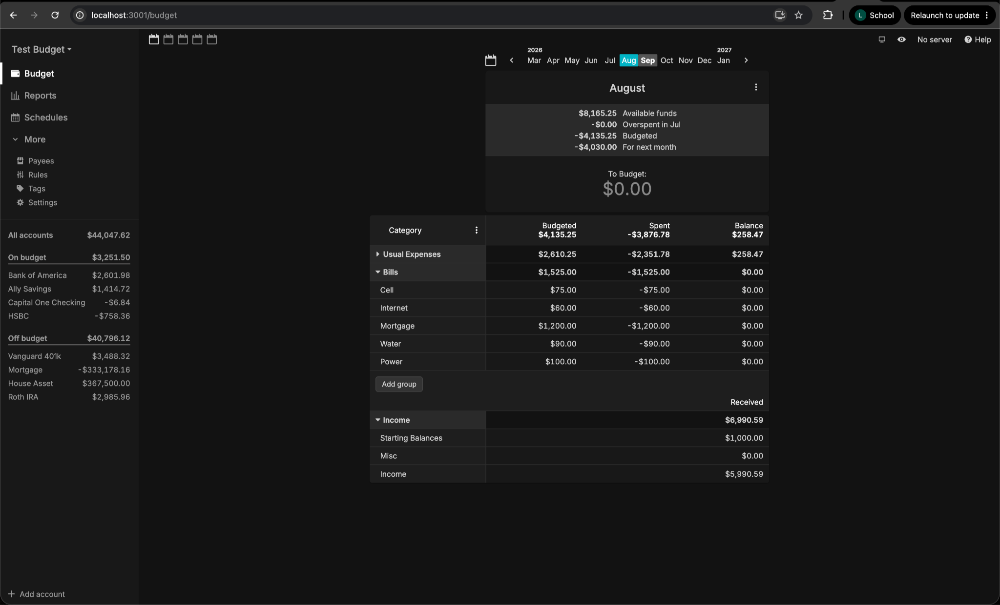
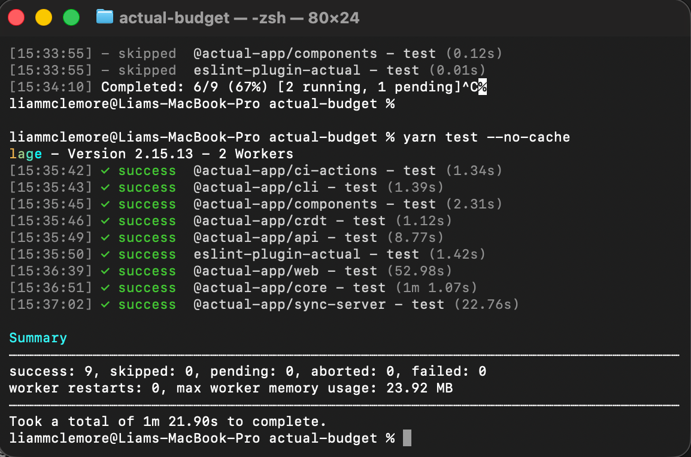

# The Budgeters - Actual Budget

**Repository:** [github.com/CSCI-435-SE/actual-budget](https://github.com/CSCI-435-SE/actual-budget)

## Members

| Name                | GitHub                                                                                              |
| ------------------- | --------------------------------------------------------------------------------------------------- |
| Liam McLemore       | [TigerK9](https://github.com/TigerK9)                                                               |
| Isabella Sasso      | [icsasso](https://github.com/icsasso)                                                               |
| Bennett Matuszewski | [bennettmatuszewski](https://github.com/bennettmatuszewski) / [BenBonk](https://github.com/BenBonk) |
| Sara Strick         | [sgstrick](https://github.com/sgstrick)                                                             |
| Reese Bryan         | [RaccoonSwarm](https://github.com/RaccoonSwarm)                                                     |
| James Leonard       | [jamesleonard3rd](https://github.com/jamesleonard3rd)                                               |

---

## Screenshots

**Actual Budget running locally:**

**Actual Budget test suite passing:**

---

## Project Overview

### What does the system do? Who are its users? What are its main features?

The system is a budgeting application that's built around the envelope budgeting method. It has a dashboard that monitors cash flow and allows the user to allocate funds into different spending categories, and to adjust their budget/spending across multiple financial accounts while maintaining privacy over their financial data.

The system is primarily used by individuals who want more control over their personal finances without having to rely on a paid third-party app or person. It's open source, so users range from privacy-conscious people who run their own servers to developers who expand the codebase.

The following are some of the main features:

- **Envelope budgeting:** Dollars are assigned to specific categories so users only spend what they've budgeted
- **Account management:** Tracks checkins, savings, credit cards, and loan accounts with both manual or automated bank syncing.
- **Scheduled transactions:** Automates recurring income and fixed expenses like bills or subscriptions to predict future balances.
- **Synchronization:** Data can be synchronized across multiple devices using a self-hosted server.

### What are the main components and how do they interact?

The main components of Actual:

- **Budget dashboard:** The central page that utilizes the envelope method and displays category groups, budgeted amounts, actual spending, and the remaining balances.
- **Account ledger:** The transaction log where users view, filter, and fix individual payments and deposits; tied to specific checking, savings, or credit accounts.
- **Schedules hub:** The place where you can view payments for recurring bills, subscriptions, and expected income.
- **Reports view:** An analysis of all the data from the accounts and categories to help users visualize what's actually happening

The modules are all interconnected. When a user logs a transaction in the Account page, it updates the budget page by deducting or adding funds to the corresponding category's envelope. If the transaction matches a recurring item in schedules, the schedule marks it as paid and updates other things. All transactional data feeds into the reports module and updates the visual charts automatically.

### What are the major technologies, frameworks, and external services?

The entire codebase is written in TypeScript/JavaScript (Node.js). Everything from business logic to frontend views to desktop wrappers is written in TypeScript/JavaScript and executed through Node.Js

**Frameworks:**

- **React:** Powers the UI, handling component rendering.
- **Vite:** Used for the frontend for faster module compilation and replacement.
- **Electron:** Used to wrap the web application in a native cross-platform binary for Mac, Windows, and Linux.
- **Yarn:** Allows for the monorepo workspace and links the internal packages together.

### How is the code organized (directory structure, key packages/modules)?

_(This is directly from the organization page; more details in their documentation.)_

Actual is organized into different packages as a monorepo using Yarn workspaces. The following are the key packages:

| Package              | Path                                                             | Description                                                                       |
| -------------------- | ---------------------------------------------------------------- | --------------------------------------------------------------------------------- |
| loot-core            | `packages/loot-core/`                                            | The core logic that runs on any platform                                          |
| desktop-client       | `packages/desktop-client/` _(alias `@actual-app/web`)_           | The React-based UI for web and desktop use                                        |
| desktop-electron     | `packages/desktop-electron/`                                     | Electron wrapper for the desktop application                                      |
| api                  | `packages/api/` _(alias `@actual-app/api`)_                      | Public API for programmatic access to Actual                                      |
| sync-server          | `packages/sync-server/` _(alias `@actual-app/sync-server`)_      | Synchronization server for multi-device support                                   |
| component-library    | `packages/component-library/` _(alias `@actual-app/components`)_ | Reusable React UI components                                                      |
| crdt                 | `packages/crdt/` _(alias `@actual-app/crdt`)_                    | CRDT (conflict-free replicated data type) implementation for data synchronization |
| plugins-service      | `packages/plugins-service/`                                      | Service for handling plugins/extensions                                           |
| eslint-plugin-actual | `packages/eslint-plugin-actual/`                                 | Custom ESLint rules specific to Actual                                            |
| docs                 | `packages/docs/`                                                 | Documentation website built with Docusaurus                                       |

### How do developers typically contribute? What is the PR and code review workflow? What are the standards for issue reporting, triage, and management?

Developers typically contribute in a very similar way to what we talked about in class. They recommend developers read the relevant files first to understand how the implementation currently works. Then make focused incremental changes, small changes focusing on a single feature or bugfix. Then type check the changes. Then run `yarn lint` to make sure it follows style guidelines. Then run the tests on it, and finally fix any issues that arise.

The PR workflow is to first link the issue or feature request ticket to it if applicable. The way they recommend is to add the text "Fixes #\<ticket_number\>" in the PR description. Then add a release note - so the notes can be included if this is added to the next release. Once the PR is ready for review, remove the `[WIP]` label from the PR title. Then wait for maintainers to review the work and this can take a while.

To triage an issue, you should give it two different types of labels. The first label is a contextual label, which describes the area or feature the issue relates to, i.e. reports, accounts, transactions. Then add a call to action label such as `help wanted`, `good first issue`, or `tech debt`. If more info is needed, you can add the label `needs info`.

---

## Feature Backlog Summary

How many issues were created; themes or categories; top 3-5 features the team is most interested in pursuing during the semester. Link to the issues.

---

## Standard Document Summary

I think this is just what Bennett has already created, we could copy and paste here. Key conventions adopted; any deviations from the project's existing guidelines and why. [Link to standards.md](https://github.com/CSCI-435-SE/actual-budget/blob/master/docs/sprint0/standards.md)

---

## Completed PRs

| PR Title                                                                                                                         | Issue                                                         | Author               | Reviewed By          | Status            | Brief Description                                                                                                                                         |
| -------------------------------------------------------------------------------------------------------------------------------- | ------------------------------------------------------------- | -------------------- | -------------------- | ----------------- | --------------------------------------------------------------------------------------------------------------------------------------------------------- |
| [[AI] Add horizontal scroll to change the budget month. #37](https://github.com/CSCI-435-SE/actual-budget/pull/37)               | [#21](https://github.com/CSCI-435-SE/actual-budget/issues/21) | TigerK9 (Liam)       | bennettmatuszewski   | Closed and Merged | This PR allows users to horizontally scroll over the budget summaries in the budget page to allow for a better UX.                                        |
| [[AI] Limit account name length to 50 characters with a live counter. #35](https://github.com/CSCI-435-SE/actual-budget/pull/35) | [#20](https://github.com/CSCI-435-SE/actual-budget/issues/20) | TigerK9 (Liam)       | RaccoonSwarm (Reese) | Closed and Merged | This PR adds a limit of 50 characters to account names. The limit exists at account creation and renaming accounts. There is a live x/50 character count. |
| [[AI] Highlight overspent category balance in yellow- #44](https://github.com/CSCI-435-SE/actual-budget/pull/44)                 | [#17](https://github.com/CSCI-435-SE/actual-budget/issues/17) | icsasso (Isabella)   | RaccoonSwarm (Reese) | Closed and Merged | This PR adds a yellow state to Balance column when current month's spending > month's budgeted amount, but the balance (including rollover) is still ≥ 0  |
| [[AI] feat: make calendar icons larger (#27)- #40](https://github.com/CSCI-435-SE/actual-budget/pull/40)                         | [#27](https://github.com/CSCI-435-SE/actual-budget/issues/27) | icsasso (Isabella)   | TigerK9 (Liam)       | Closed and Merged | This PR increased the calendar icon's size to help usability of the click target.                                                                         |
| [[AI] Limit notes to 1800 characters with a warning near the limit- #34](https://github.com/CSCI-435-SE/actual-budget/pull/34)   | [#10](https://github.com/CSCI-435-SE/actual-budget/issues/10) | bennettmatuszewski   | TigerK9              | Closed and Merged | This PR added a limit of 1800 characters to all notes inside the application, with toast warnings when approaching/reaching the character limit.          |
| [[AI] Add hover cursor and background to month-count calendar icons- #31](https://github.com/CSCI-435-SE/actual-budget/pull/31)  | [#25](https://github.com/CSCI-435-SE/actual-budget/issues/25) | bennettmatuszewski   | RaccoonSwarm         | Closed and Merged | This PR improved the UI/UX for the month count viewer in the budget tab, by making the buttons appear more clickable.                                     |
| [[AI] feat: add category dropdown menus (#18)](https://github.com/CSCI-435-SE/actual-budget/pull/18)                             | [#18](https://github.com/CSCI-435-SE/actual-budget/issues/18) | sgstrick             | icsasso              | Closed and Merged | This PR added a dropdown menu for assigning categories.                                                                                                   |
| [[AI] bug: fix dropdown cursor on budget page (#28)](https://github.com/CSCI-435-SE/actual-budget/pull/28)                       | [#28](https://github.com/CSCI-435-SE/actual-budget/issues/28) | sgstrick             | jamesleonard3rd      | Closed and Merged | This PR fixes a bug where the dropdown menu persists after closing the budget page.                                                                       |
| [[AI] feat: limit budget category name length (#9)](https://github.com/CSCI-435-SE/actual-budget/pull/9)                         | [#9](https://github.com/CSCI-435-SE/actual-budget/issues/9)   | RaccoonSwarm (Reese) | bennettmatuszewski   | Closed and Merged | This PR enforces a character limit of 50 to user-added budget categories.                                                                                 |
| [[AI] fix: budget name dropdown (#16)](https://github.com/CSCI-435-SE/actual-budget/pull/16)                                     | [#16](https://github.com/CSCI-435-SE/actual-budget/issues/16) | RaccoonSwarm (Reese) | sgstrick             | Closed and Merged | This PR fixes a bug that caused a dropdown menu to persist after the sidebar that originated it was closed.                                               |
| [[AI] feat: currency formatting](https://github.com/CSCI-435-SE/actual-budget/pull/26)                                           | [#26](https://github.com/CSCI-435-SE/actual-budget/issues/26) | jamesleonard3rd      | sgstrick             | Closed and Merged | This PR implements the previously experimental disabled background feature of adding currency formatting as a setting.                                    |
| [[AI] feat: filter keybind '/'](https://github.com/CSCI-435-SE/actual-budget/pull/13)                                            | [#13](https://github.com/CSCI-435-SE/actual-budget/issues/13) | jamesleonard3rd      | icsasso              | Closed and Merged | This PR allows the use of '/' as a keybind to quickly enter the filtering text boxes and begin typing.                                                    |

---

## AI Tool Usage

### Liam — [ai-logs/sprint0/tigerk9](https://github.com/CSCI-435-SE/actual-budget/tree/master/ai-logs/sprint0/tigerk9)

The only AI tool I used in this sprint was Claude code, which I used through an extension on VS code. I only had three sessions, one for each of the PR's I did myself and one for a PR I reviewed (the other PR I manually checked). For the sessions that I did my PR, I would have Claude help me set up the git working environment (creating branches, committing, etc.), then I would go to the web page myself to find the exact component I want to work with, then I'd manually look at where I thought the change might be, and would point Claude towards the component I thought was pertinent, and through the planning mode would come up with a plan with Claude. If the plan sounded good I'd have Claude implement it. After tweaking and getting the change to work with my manual changes, I would have Claude create its own vitests for it, then have it check it all again. Finally I'd have it do the git submitting things. For reviewing the one PR, it was a more complicated change I couldn't understand on my own, so I used Claude to help with checking the PR. Claude all around worked very well, I don't have any observations.

### Isabella — [ai-logs/sprint0/icsasso](https://github.com/CSCI-435-SE/actual-budget/tree/master/ai-logs/sprint0/icsasso)

For this sprint, I used Claude through their website and through the VS code extension as well. In the webchat, I used Claude to help me figure out how to download and use yarn, as I didn't have any previous experience with it. Also using the webchat, I used Claude to help me with issue generation; I had come up with a few ideas on my own, and others with some help from my teammates, but I had trouble elaborating on my thoughts, which Claude helped me with. With the VS code extension, I used Claude to implement the code changes necessary to resolve the issues I chose to work on, and it worked very well. I think this is because it was able to read through and "understand" the codebase faster than I could, so it was particularly helpful with finding which files and what code needed to be changed. The changes implemented were also relatively simple, so I didn't end up using too many tokens either. Claude helped me test as well, but I also went and used "yarn start" to manually check that changes were working correctly. I had 4 sessions in total, one for figuring out yarn stuff, one for issue generation, and then the remaining two were solving issues/PR-related. What worked best for me was to put Claude on "manual" where I review everything the AI wants to do before it does anything. Before that, when I let it go ahead and do whatever it wanted, I started getting confused because it would go and start tasks I never assigned, so I made sure to be more careful.

### Bennett — [ai-logs/sprint0/bennettmatuszewski](https://github.com/CSCI-435-SE/actual-budget/tree/master/ai-logs/sprint0/bennettmatuszewski)

Similar to others, I exclusively Claude for this Sprint. Starting with issue generation, I found some features I thought would be good additions and had Claude web generate issue templates to use, which turned out well. On the code side of things, I used Claude Code through the VS Code extension which is usually my go to. This worked quite well, and Claude was very helpful in helping me locate certains files/where logic lives, as well as create the fixes and tests for my PRs. This being said, I tried my best to not fully rely on Claude though and make sure to understand the codebase and what changes it made, for both my PRs, which I think worked out. I also used Claude when reviewing other student's PRs. I would first read the changes myself, run all tests, and make sure the change appeared in the application. Then I would prompt Claude to help me find any other potential issues with the PR, which I think worked well, as Claude does have a deeper understanding of web development and typescript than I do. Overall my AI experience thus far has been quite positive. The only hardship I've faced is that initially Claude kept committing changes via my personal Github account "BenBonk" instead of "bennettmatuszewski" which I attempted to fix, so hopefully that is ok for this sprint, and I will try to make sure that doesn't happen in the future. I'm sure I will have more observations on Claude's performance in upcoming sprints as I begin to work on more complex features.

### Sara — [ai-logs/sprint0/sgstrick](https://github.com/CSCI-435-SE/actual-budget/tree/master/ai-logs/sprint0/sgstrick)

I used Claude.ai in my browser. I used it in order to find and understand the sections of code for each issue. I then used it to brainstorm and write code that would solve the issues. I am new to AI, so I only used one continuous session, and included the relevant prompts in my logs. It was a learning curve as to how to ask prompts more efficiently and testing and trusting the results it gave me. I think it went well, but I worry that I may be relying on it too much given the fact that the code is unfamiliar to me.

### Reese — [ai-logs/sprint0/RaccoonSwarm](https://github.com/CSCI-435-SE/actual-budget/tree/master/ai-logs/sprint0/RaccoonSwarm)

During Sprint 0, I used Claude code through a VS Code extension. I used Claude to generate one of my issue descriptions but manually wrote the others to make them more concise and natural sounding. I also used Claude to help verify where relevant code was for a particular issue. I then used it to help plan and execute a solution, and then I used it to create and run any automated tests. I occasionally used the agent to verify how to perform various operations related to git to ensure I was not messing up anything on the project repository. I had four total sessions, one to help generate the issue description for issue #22, one to help troubleshoot an issue I had with git, and the other two for the two small issues I was working on: issues #9 and #16. I mostly utilized the "Plan" mode after Claude made some changes I had to revert when first trying it out. I also would switch to manual mode on occasion to double-check each step as it was occurring. This helped me make sure that I fully understood what Claude was doing. I found it took a bit more effort to understand the code when Claude generated it all at once than if I had guided it more or written it myself, but I am pleasantly surprised with how well it generated code. I am a bit worried about over-using it or relying on Claude too much, but I think that can be avoided with periodic personal reflections about my efforts.

### James — [ai-logs/sprint0/jamesleonard3rd](https://github.com/CSCI-435-SE/actual-budget/tree/master/ai-logs/sprint0/jamesleonard3rd)

I used Claude throughout sprint 0 through the VS Code equivalent extension in Cursor. I used Claude to validate my concept location of where issues were located in the repo, and explain project structure to develop a better understanding of how it worked. I then either proposed a basic plan idea to Claude and asked it to improve on it, or asked Claude to develop and implement a plan to divide the changes into different steps, especially for the currency issue where a large multi step plan was needed. I asked my agent questions about git to ensure I wouldn't create any issues, being relatively new to merging and handling pull requests. I heavily used Claude's plan mode. I had a total of 9 sessions.

---

## Release

**Sprint 0 Release:** [v26.9.0-csci435-s0](https://github.com/CSCI-435-SE/actual-budget/releases/tag/v26.9.0-csci435-s0)

---

## Risks & Challenges

Working with git was a little difficult sometimes, we had to get accustomed to it again. We especially had trouble with keeping our master branch locally updated, and checking other people's work by getting their branches onto our machines locally.

Something that might slow down Sprint 1: more issues/things to be changed that are less UI-related and will require a better, deeper understanding of the codebase in order to implement things properly

---

## Sprint 1 Ideas

- Making Actual Budget have accessibility modes could be a bigger change that we can tackle.
- Medium scoped issues in the existing backlog
- We don't have anything else we need to set up, it works for all of us, though the tests don't run for the majority of the team.
- We are going to have a Stand-Up meeting set up for every week
